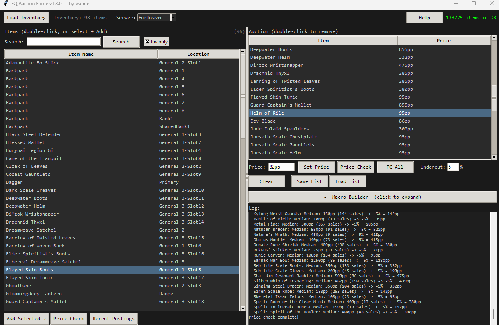

# EQ Auction Forge

Generate EverQuest social macros with **clickable item links** for EC Tunnel trading. No more manually shift-clicking items into macros — search your inventory, set prices, and export directly to your character INI file. Or just use it as a quick **price-check** tool.



## Download

**Just want to use it? (no Python needed)**

1. Go to the [Releases page](https://github.com/wangel/EQ_Auction_Forge/releases)
2. Download `EQ_Auction_Forge_vX.Y.Z_Windows.zip`
3. Unzip it anywhere — your Desktop or Downloads is fine (avoid `Program Files`)
4. Keep `EQ_Auction_Forge.exe` and `items.txt.gz` **in the same folder**
5. Double-click `EQ_Auction_Forge.exe`

**Developers / other platforms:** see [Running from source](#running-from-source) below.

## Features

- **Item Link Generation** — Generates proper EQ item links with clickable purple text using pre-computed link hashes from the [items.sodeq.org](https://items.sodeq.org) database
- **Inventory Integration** — Load your `/outputfile inventory` dump to see only items you actually have. Duplicate/stacked items are combined and shown with a quantity, and the count carries through to the macro (e.g. `<Singing Steel Bracer> 500p x2`)
- **Explorer-style selection** — Shift-click a range, Ctrl-click to toggle, or Ctrl+A to select all; add with Enter, remove with Delete
- **Price Checking** — Fetch real-time pricing from [TLP Auctions](https://www.tlp-auctions.com) with median-based pricing (more accurate than averages)
- **Quick price-check mode** — The macro-building controls collapse out of the way, so you can use it purely to look up prices
- **Auto-Packing** — Automatically fits as many items per line as possible while staying under EQ's 255-character limit, with up to 5 lines per macro button
- **Full socials support** — Spreads macros across all 12 buttons per page, up to Page 10, and warns you if your list is too big to fit
- **Krono Pricing** — High-value items are automatically formatted in Krono (e.g., `2kr 500p`)
- **Direct INI Writing** — Write macros directly to your character INI file with automatic backup
- **Save/Load** — Save your auction lists to JSON for quick reloading

## Running from source

### Requirements

- Python 3.8+ with **tkinter** (included in the official [python.org](https://www.python.org/downloads/) installer on Windows/macOS; on Linux install `python3-tk`)
- No third-party packages — standard library only (see [requirements.txt](requirements.txt))
- `items.txt.gz` item database (included, sourced from [items.sodeq.org](https://items.sodeq.org))

### Install & run

```bash
git clone https://github.com/wangel/EQ_Auction_Forge.git
cd EQ_Auction_Forge
python EQ-Auction_Forge.py
```

No `pip install` needed — runs entirely on Python's standard library.

## Usage

### Quick Start

1. In-game: `/outputfile inventory` to dump your inventory
2. Launch the app (double-click the `.exe`, or `python EQ-Auction_Forge.py`)
3. Click **Load Inventory** and select your inventory file
4. Check **Inv only** to filter to items you own
5. **Double-click** items to add them — or Shift/Ctrl-click (or Ctrl+A) several and press **Enter** / **Add Selected**
6. Click **PC All** to price check everything via TLP Auctions
7. Adjust prices as needed (select item → type price → **Set Price**)
8. Expand **Macro Builder**, then click **Generate** to build the macros
9. Click **Write to INI** to write directly to your character file

### Command Line Options

```bash
python EQ-Auction_Forge.py                              # Default
python EQ-Auction_Forge.py --db /path/to/items.txt.gz   # Custom item database
```

### Supported Servers (Price Checking)

Price checking uses [TLP Auctions](https://www.tlp-auctions.com) data. The server dropdown lists **Frostreaver** — once a TLP gets the Bazaar, its tunnel-trade data dries up, so that's the only actively useful server for now. The box is editable, so you can type another server TLP Auctions tracks if needed.

### How Item Links Work

EQ item links use a special character (DC2, hex `0x12`) as a delimiter around the item's hash data. The hash includes the item ID and a checksum that the client validates. This tool uses a pre-built database of item hashes so you don't need to extract them manually.

**Important:** When writing to your INI file manually (not using Write to INI), save as **ANSI encoding**, not UTF-8. In Notepad++: `Encoding → ANSI → Save`.

## Item Database

The `items.txt.gz` file contains item data from [items.sodeq.org](https://items.sodeq.org). On first run it is extracted to a per-user cache folder (`%LOCALAPPDATA%\EQAuctionForge\items.txt` on Windows). To update it:

1. Download the latest item dump from [items.sodeq.org](https://items.sodeq.org)
2. Replace `items.txt.gz` next to the app
3. Delete the cached `items.txt` in `%LOCALAPPDATA%\EQAuctionForge\` (it will be re-extracted on next run)

## Credits

- Item data: [items.sodeq.org](https://items.sodeq.org)
- Pricing data: [TLP Auctions](https://www.tlp-auctions.com) ([API Docs](https://api.tlp-auctions.com/swagger/index.html))

## License

**GNU Affero General Public License v3.0 or later (AGPL-3.0-or-later)** — see [LICENSE](LICENSE).

Copyright (C) 2026 wangel. This is free software: use it, study it, share it, and
change it. But if you distribute it **or run a modified version as a network
service**, you must release your complete source under the same license. In plain
terms: you can't take this, close the source, and sell it. Built for the EQ
community, staying open for the EQ community.

## Support

If you find this useful, consider buying me a coffee!

[](https://ko-fi.com/wangel)
